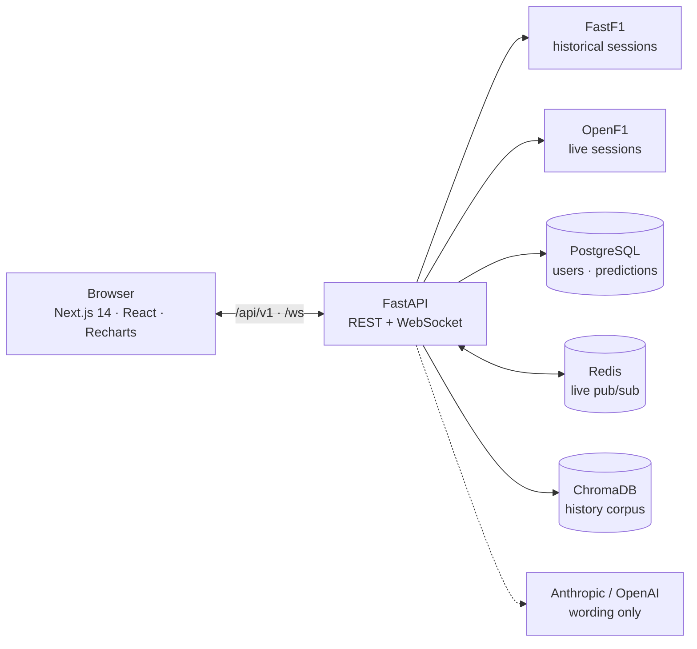

<div align="center">

# 🏁 PIT WALL

### The Formula 1 timing screen, for every race since 2018.

Overlay two drivers' laps. Replay a whole grand prix on the real clock. Rewrite a pit stop and see what it would have cost.<br/>
Every number comes from official F1 timing data. The AI only writes the words.

<br/>


<br/>


[**Quick start**](#-quick-start) &nbsp;·&nbsp; [**Features**](#-what-you-can-do) &nbsp;·&nbsp; [**Architecture**](#-how-its-put-together) &nbsp;·&nbsp; [**Design system**](#-the-timing-screen-design-system) &nbsp;·&nbsp; [**Testing**](#-testing)

</div>

<br/>

## ⚡ What you can do

| | Module | What it does |
|---|---|---|
| 📡 | **Live timing** | Positions, gaps and tyre ages as they happen, with an AI race engineer on the radio. |
| 🗺️ | **Track map** | Every car on the circuit live, or pick a past race and **replay it lap by lap on the real clock**. |
| ⚔️ | **Head to head** | Overlay two drivers' laps across speed, throttle, brake, gear, RPM, DRS and acceleration, with a gap trace and a dominance map showing who won each mini-sector. |
| 🦶 | **Advanced analytics** | Throttle, brake and coasting behaviour for every driver across a session. |
| 🛞 | **Strategy simulator** | Test a tyre strategy against a real session's own degradation data, planned against the true race distance. |
| 📰 | **Race debrief** | An auto-written summary of any race since 2018, plus **what-if counterfactuals** on real strategies. |
| 📚 | **Archive** | Browse past seasons, calendars and results. Only races that have finished are offered. |
| 🏆 | **Season stats** | Driver and constructor championship standings since 2018. |
| 🎯 | **Predictions** | Call the podium before lights-out and climb the season leaderboard. |

### One picker, every page

Head to head, Advanced analytics, Strategy and Track map all start from the same picker: a season, then only completed races, then only the sessions that weekend actually ran. Races are identified by round number, so every view is a shareable link:

```text
/compare?year=2024&round=14&d1=VER&d2=NOR
/advanced?year=2024&round=14&session=Q
/strategy?year=2024&round=14
/map?year=2024&round=14
/debrief?year=2023&race=Belgian Grand Prix
```

### 🧠 AI that can't make things up

- **Deterministic first.** Every figure (results, gaps, stints, degradation, what-if deltas) is computed by ordinary code over FastF1 data.
- **The model writes the wording, nothing else.** Its output is checked against the real result before it is shown.
- **Always degrades gracefully.** With no API key, or if the model's answer doesn't check out, you get a template instead of an error.
- **What-if** is a small LangGraph flow (`simulate` → `explain`): move a pit stop or swap a stint's compound and see what the tyre model says it would have done to race time.
- **Historical RAG.** The live race engineer can answer cross-season questions from an ingested history corpus in ChromaDB ([optional](#-optional-history-for-the-ai-race-engineer)).

### 🎯 Accounts and the prediction game

- Email and password accounts: bcrypt, JWT in an httpOnly cookie, CSRF protection, server-side logout.
- Pick the top 3 for an upcoming race. Picks lock at lights-out (checked against the official UTC schedule) and are scored against the real result: **25 points** for an exact podium, **10** per driver in the real top 3.
- Known gaps, by design: no email verification or password reset, no rate limiting on login and signup, and signup reveals whether an email is registered.

<br/>

## 🚀 Quick start

You need **Python 3.12**, **Node 20+** and **Docker** (for Postgres and Redis).

**1. Configure**

```bash
cp .env.example .env
```

Open `.env` and set:

| Variable | Value |
|---|---|
| `SECRET_KEY` | Required. Generate one: `python -c "import secrets; print(secrets.token_hex(32))"` |
| `RUNNING_LOCALLY` | `true` when the backend runs on your machine rather than in Docker |
| `ANTHROPIC_API_KEY` / `OPENAI_API_KEY` | Optional. Without them the AI features fall back to templates |

**2. Start Postgres and Redis**

```bash
docker compose up -d postgres redis
```

**3. Start the backend** (http://localhost:8000)

```bash
cd backend
python -m venv .venv
.venv\Scripts\activate          # macOS/Linux: source .venv/bin/activate
pip install -r requirements.txt
uvicorn app.main:app --port 8000
```

**4. Start the frontend** (http://localhost:3000)

```bash
cd frontend
npm install
npm run dev
```

Open **http://localhost:3000**. The first load of a session downloads its data from FastF1, so give it a moment; it's cached after that.

> **Prefer containers for everything?** `docker compose up --build -d` builds and runs the frontend and backend too. Note that the compose file expects the Docker service hostnames, so leave `RUNNING_LOCALLY=false` in that case.

<br/>

## 🧱 How it's put together



| Layer | Stack |
|---|---|
| **Frontend** | Next.js 14, React 18, TypeScript, Tailwind CSS, Recharts, framer-motion, react-grid-layout, Zustand, Lucide |
| **Backend** | Python 3.12, FastAPI, SQLAlchemy, FastF1, pandas / NumPy, LangGraph |
| **Data** | PostgreSQL 16, Redis 7, ChromaDB |
| **AI** | Anthropic (default `claude-opus-5`) with an OpenAI fallback. Override with `ANTHROPIC_MODEL` / `OPENAI_MODEL` |

<details>
<summary><b>API reference</b> (all under <code>/api/v1</code>)</summary>

<br/>

| Area | Endpoints |
|---|---|
| **Races** | `GET /races/historical` · `GET /races/session-info` · `GET /races/results` · `GET /races/latest-result` |
| **Telemetry** | `POST /telemetry/compare` · `POST /telemetry/pedal-behavior` · `GET /telemetry/replay` |
| **Strategy** | `POST /strategy/simulate` · `GET /sessions/{session_key}/strategy` |
| **Live** | `GET /sessions/active` · `GET /sessions/{session_key}/drivers` · `.../timing` · `.../weather` · `.../race-control` · `.../radios` · `GET /circuits/{session_key}/layout` · WebSocket `/ws/{client_id}` |
| **AI** | `GET /debrief` · `POST /whatif` · `POST /ai/chat` |
| **Stats** | `GET /stats/standings` · `GET /drivers/known-codes` · `GET /drivers/{driver_code}/season-insights` · `GET /share/result-card` |
| **Accounts** | `POST /auth/signup` · `/auth/login` · `/auth/logout` · `GET /auth/me` |
| **Predictions** | `POST /predictions` · `GET /predictions/me` · `GET /leaderboard` · `POST /predictions/score` |

Interactive docs are served by FastAPI at http://localhost:8000/docs.

</details>

<br/>

## 🎨 The "Timing Screen" design system

The look is the official one: the near-black navy of an F1 broadcast feed, F1 red, and squared-off graphics cut with a hairline rather than a curve.

**One rule: colour only carries meaning.** Chrome is greys and white. Colour appears only as timing semantics (purple overall best, green personal best, yellow off pace), live/danger red, tyre compounds and team colours.

- 🔴 **Red has exactly three jobs:** the frame (wordmark, the rule under the top bar, the bar beside a page title), the primary action, and the on-air state. It is never a solid block anywhere else.
- ⚪ **White marks where you are:** the current page, the selected tab, the channels switched on.
- 🔤 **Type:** Titillium Web for headlines, captions and labels, Barlow Semi Condensed for UI and data (tabular figures). Both self-hosted.
- 📊 **Tables read as timing towers:** team colour flush to the row's left edge, faint banding, tabular figures.
- ♿ **Contrast is tested:** the tokens in `frontend/src/design/tokens.css` are checked against WCAG AA by `tokens.test.ts`.

| | Where |
|---|---|
| Tokens | `frontend/src/design/tokens.css`, mapped in `tailwind.config.ts` |
| Primitives | `frontend/src/components/ui/` (Panel, Button, Select, Input, Tabs, DataTable, …) |
| Shell and command palette | `frontend/src/components/shell/` |
| Adding a page | One entry in `frontend/src/lib/modules.ts`. The rail, mobile tab bar, palette and landing page all read it. |

<br/>

## 🧪 Testing

```bash
# Frontend
cd frontend
npm test                                # vitest
npm run typecheck                       # tsc --noEmit
node scripts/check-legacy.mjs --all     # no legacy styles
node scripts/ui-sweep.mjs               # overflow, crashes, labels, contrast at 390/768/1280px
                                        # (needs the dev server and API running)

# Backend
cd backend
SECRET_KEY=test RUNNING_LOCALLY=true python -m pytest -q
```

GitHub Actions runs pytest, `tsc`, vitest and a production build on every push and pull request to `master`.

<br/>

## 🧠 Optional: history for the AI race engineer

The race engineer can answer cross-season questions ("how did Verstappen's strategy at Spa compare across recent years") once its corpus is built. The app runs fine without it and the engineer stays live-session-only.

```bash
docker compose up -d chromadb
cd backend
python -m app.scripts.ingest_history --years 2018-2025
```

The first run can take **several hours**, because FastF1 loads each session fresh. It's safe to interrupt with Ctrl-C and rerun; sessions already ingested are skipped. Rerun with just the new year (`--years 2026`) to pick up newly completed weekends.

<br/>

<div align="center">

**Built for people who watch the timing screen more than the TV.**

</div>
